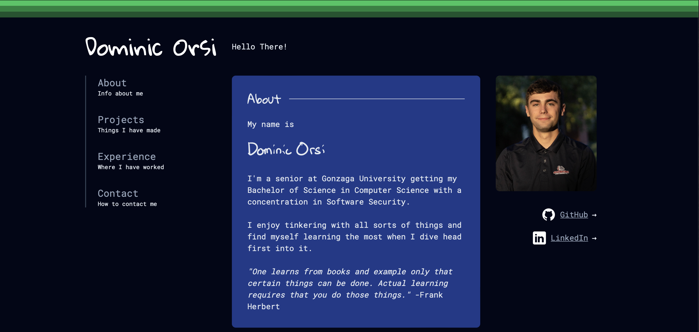

# About Me 👨‍💻
Hello❗

I'm Dominic, (yea that is me) also a tinkerer and learner. 

Go ahead and visit my personal website!

## Projects 💻
<table>
  <tr>
    <td>
      
    </td>
    <td>
      
    </td>
  </tr>
  <tr>
    <td>
      
    </td>
    <td>
      
    </td>
  </tr>
  <tr style="text-align: center">
    <td colspan="2">
      
    </td>
  </tr>
</table>

## Languages 🪛

  &nbsp;
  &nbsp;
  &nbsp;
  &nbsp;
  &nbsp;
  &nbsp;
  &nbsp;
  &nbsp;

## Databases 📀

  &nbsp;
  &nbsp;
  &nbsp;

## Cloud ☁

  &nbsp;
  &nbsp;

## Operating Systems 💻

  &nbsp;
  &nbsp;
  &nbsp;

## Learning 📝

  &nbsp;
  &nbsp;
  &nbsp;

## Some Stats 📊

